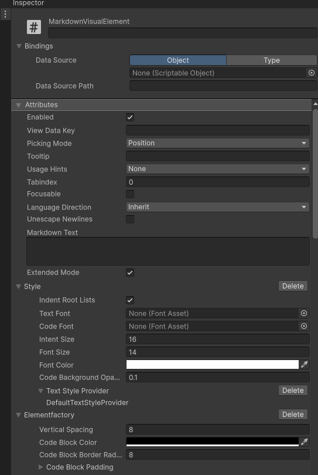

# Usage

## Rich Text

RichText created by UMarkdown can be used together with:

- `TextMeshPro` components
- `UIElements.Label` elements
- `Debug.Log` outputs
- Any other Unity component that supports proper rich text formatting.

### C# Code

You can convert Markdown content into Unity rich text strings using the following method:

``` { .csharp .focus hl_lines="2"}
public void ConvertMarkdownToRichText() {
    var richText = UnityMarkdown.ToRichText("My **Markdown** Content");
    Debug.Log(richText);
}
```

Additionally, you can customize the conversion process by providing a custom style:

``` { .csharp .focus hl_lines="2"}
var richText = UnityMarkdown.ToRichText("My **Markdown** Content",
    style: new RichTextMarkdownStyle { FontSize = 18 }
);
```

## Visual Element

The `MarkdownVisualElement` has two different modes in which it can be used:

- `ExtendedMode=true`: In this mode, the visual element will render the Markdown content
  using **multiple child visual elements**. This allows for **better styling** and interaction
  with the content but may have a higher performance overhead.  
  The `ElementFactory` will then be used to create the individual visual elements.
- `ExtendedMode=false`: In this mode, the visual element will convert the Markdown content
  into a **single rich text string** and display it using a single element. This mode is
  generally **faster** but may have **limitations in terms of styling and interaction**.

### C# Code

You can create a new markdown element via C# code like shown below:

``` { .csharp .focus hl_lines="2"}
public void CreateMarkdownElement() {
    var element = UnityMarkdown.ToVisualElement("My **Markdown** Content");
    Add(element);
}
```

Additionally, the style and element factory can be configured using the optional parameters:

``` { .csharp .focus hl_lines="2-3"}
var element = UnityMarkdown.ToVisualElement("My **Markdown** Content",
    style: new RichTextMarkdownStyle { FontSize = 18 },
    factory: new DefaultMarkdownVisualElementFactory()
);
```

This will always use the extended mode. If you want to use the non-extended mode, you can
manually create `MarkdownVisualElement` instead or use the `UnityMarkdown.ToRichText` method,
together with your own `Label` elements.

### UXML Editor

You can create a new markdown element by adding the `MarkdownText` element for
the custom controls section in the UXML editor, like shown below:


The attribute list of the element will expose all (editor) available options.


!!! warning "Be careful with Newlines in UXML"
    The UXML editor does not properly support newlines. If they are required for your usage,
    consider applying them via C# code or use `Unescape Newlines` together with `\n`.

